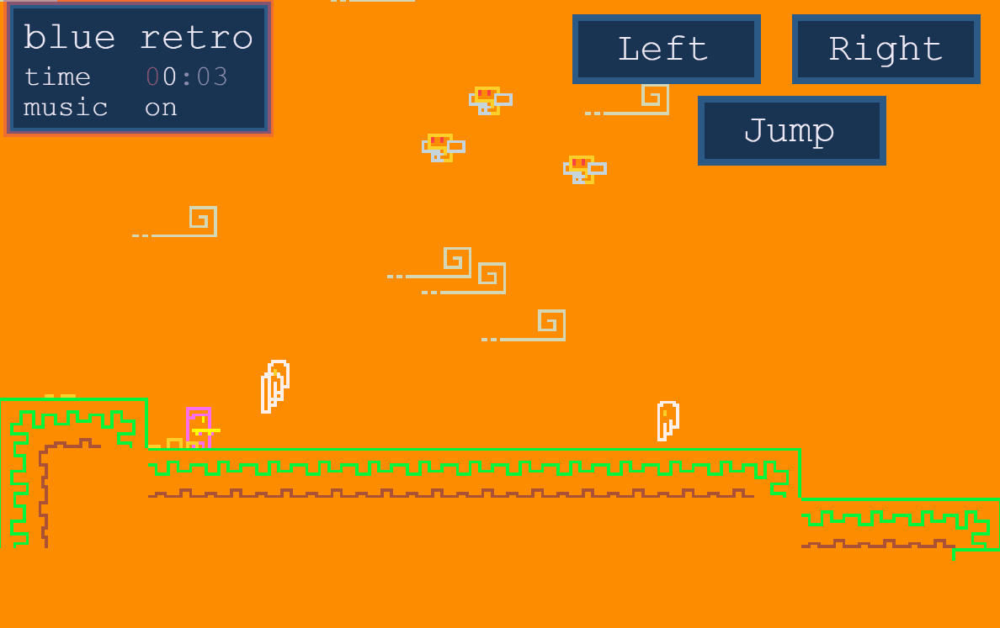

## Blue Retro JS2023 PostMortem

I made a game for JS13k called Blue Retro, which you can play [here]().

Here's what it looks like:

.

Let me tell you it's story.

I was trying to learn about AI to make a bot that can play poker. Then they called me for my planned entry into psychiatric service.

Ok too personal, but since then my everyday work had been going nearly perfect. This game is the result of my well personal being and my super luck.

Anyway, game is about a 2d platformer character, trying to be pleased by the player. It gives you clues to how you should click buttons. Then it gets a little challenging.

I really wanted people to finish my game, so I put presents to make them happy. So there is a secret code at the end of the game, which encodes your progress. So how about people send me the codes, then I share a final leaderboard.

I will confess, I have lots of free time and nothing else to do, so I started right after I released from the hospital after 3 weeks, which was about right when they announced the JS13k is coming soon. 

ChatGPT has been my biggest supporter, I put some interesting links in this repo's README, so please check them out.

I also have a discord where I share pixel art and game dev topics that I find interesting, [here](https://discord.gg/6CnntAz9).

So art belongs to [this guy](https://twitter.com/_V3X3D/status/1683813077022658562?s=20), thanks to him.

Colors I used belongs to [this guy](https://twitter.com/mr_catfry/status/1684182716051234818?s=20), thanks to him.

Audio code, and music belongs to [https://github.com/arikwex/infernal-sigil](https://github.com/arikwex/infernal-sigil), thanks to him.

Let's get into details;

I am writing this post mortem, while coding the game, I don't know if people do that, but it's not something to be written after you develop the game.

I also have been active in Slack group, so check that out too.

I use vite development server, for instant updates and smooth development experience, and vast plugins.

I have a tool called [aset](https://github.com/eguneys/aset), which parses aseprite files, and for packing those into an atlas. I have scripts to watch for file changes and load the art content directly into game, so that's good. It also optimizes the png file to shrink further.

I didn't use roadroller because of [some import.meta bug](https://stackoverflow.com/questions/76765987/cannot-use-import-meta-even-though-type-module-is-enabled-on-github-pages).

I didn't use ect just a zip, I don't know how much it would've shrinked further. I have scripts to build the final zipped dist.zip file so that's also good.

About minifying the code, vite uses terser by default, I couldn't get google closure to work, terser has some caveats which I have to manually exclude some of the variable names that shouldn't get minified, otherwise it breaks the bundled game, so that's not good.

I have github workflows setup, so It instantly releases the game into github pages after a push to main branch, so that's good to share easily.

Coding;

I've reused some of the old code from my [2022 entry](https://github.com/eguneys/mavi-js2022) which used webgl. This time I wanted to focus only on game so I rewrote that with `CanvasRenderingContext2D` which helps reduce the size. Actually I rewrote everything from scratch what am I talking about.

Except the base class called `Play` which handles grouping of objects into a nested hierarchy and manages input handlers and things like that.

I have a physics and collision detection system for platforming elements. You can check my previous entries, for [my previous experience](https://eguneys.github.io/js13k2020.html).
I handled both mouse and keyboard input because of gameplay needs.
I setup a basic scene system, where you can switch between scenes like intro gameplay credits etc.
An animation system which loads the info from parsing the content, then can play animations defined directly within aseprite by giving the filename and tag name, that's neat.

A challenging part is the tile system and auto tiles, which I managed with the help of ChatGPT and some research. I've always wondered how those spritesheets that is I think called tilesets map into level design, know I got some ideas.

### P.S.

I highly recommend checking out the author of Celeste, [NoelFB](https://github.com/NoelFB). I have a webgl rendering and game related stuff library copied from his code [here](https://github.com/eguneys/blah).
